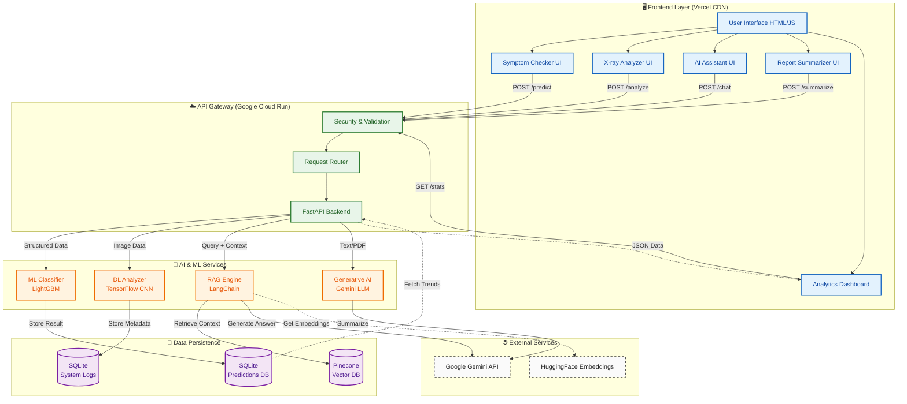

# 🏥 **Pulse AI - Advanced Healthcare Intelligence Platform**

[](https://health-care-project-v2.vercel.app/)
[](https://healthpro2-api-1079466778366.us-central1.run.app/docs)
[](LICENSE)

> **A production-grade, full-stack healthcare AI platform** combining Machine Learning, Deep Learning, and Large Language Models for intelligent medical diagnostics and patient care.

---

## 🎯 **Project Overview**

Pulse AI is an **end-to-end MLOps-driven healthcare platform** that demonstrates enterprise-level AI/ML deployment practices. Built with modern cloud-native architecture, it showcases the complete lifecycle from model training to production deployment with real-time monitoring.

### **🌟 Key Highlights**

- ✅ **4 AI-Powered Modules** - ML classification, CNN image analysis, RAG chatbot, NLP summarization, and analytics dashboard
- ✅ **Production Deployment** - Google Cloud Run (backend) + Vercel (frontend)
- ✅ **Serverless Architecture** - Auto-scaling, cost-efficient infrastructure
- ✅ **Real-time Analytics** - Live prediction monitoring and trend visualization
- ✅ **Enterprise Security** - Input validation, CORS protection, API rate limiting

---

## System Architecture



**Analytics**: Chart.js (Real-time) | Tableau (Comprehensive Dashboard)

---

## Project Documentation

📚 **Detailed Project Report**: [View Documentation](YOUR_GOOGLE_DRIVE_OR_DOCUMENT_LINK_HERE)

*Comprehensive documentation including model training process, evaluation metrics, deployment strategies, and technical deep-dive.*

---

## Core Features

### **1. 🧠 Symptom-Based Disease Prediction**
- **Technology**: LightGBM Gradient Boosting Classifier
- **Accuracy**: 92% on test dataset 
- **Input Validation**: Age (18-80), Heart Rate (50-130 bpm), Temperature (35-41°C), O₂ Saturation (85-100%)
- **Output**: Disease classification (Cold, Flu, Bronchitis, Pneumonia, Healthy)
- **Features**: Real-time prediction with confidence scores

### **2. 🫁 Chest X-ray Analysis**
- **Technology**: Custom CNN (Convolutional Neural Network) - 
- **Architecture**:  Conv layers + MaxPooling + Dense layers
- **Validation**: Smart image validator (rejects non-medical images)
- **Processing**: Automated preprocessing pipeline (resize, normalize, grayscale conversion)
- **Output**: Binary classification (Normal/Pneumonia) with confidence score

### **3. 💬 AI Medical Assistant (RAG)**
- **Technology**: Retrieval-Augmented Generation with LangChain
- **LLM**: Google Gemini 2.5 Flash
- **Vector Database**: Pinecone (medical knowledge base)
- **Embeddings**: HuggingFace `all-MiniLM-L6-v2` (90MB)
- **Features**: 
  - Context-aware medical Q&A
  - Chat history management
  - Source attribution from medical documents
  - Topic extraction and logging

### **4. 📄 Medical Report Summarizer**
- **Technology**: Google Gemini LLM
- **Input**: PDF reports or raw text
- **Output**: Concise medical summaries with key findings
- **Use Case**: Quick review of lab reports, discharge summaries

### **5. 📊 Real-time Analytics Dashboard**
- **Metrics Tracked**:
  - Prediction trends (time-series visualization)
  - Top 5 user queries
  - Disease distribution
  - System health monitoring
- **Visualization**: Chart.js + Tableau integration

---

## 🛠️ **Technology Stack**

### **Backend**
| Component | Technology | Purpose |
|-----------|-----------|---------|
| **API Framework** | FastAPI | High-performance async API |
| **ML Framework** | Scikit-learn, LightGBM | Traditional ML models |
| **DL Framework** | TensorFlow/Keras | Deep learning (CNN) |
| **LLM Integration** | LangChain, Google Gemini | RAG and summarization |
| **Vector DB** | Pinecone | Semantic search |
| **Database** | SQLite | Prediction logging |
| **Containerization** | Docker | Reproducible deployments |
| **Cloud Platform** | Google Cloud Run | Serverless backend hosting |

### **Frontend**
| Component | Technology |
|-----------|-----------|
| **UI Framework** | Vanilla HTML/CSS/JS |
| **Charts** | Chart.js |
| **Hosting** | Vercel (CDN + Auto-deploy) |
| **Styling** | Custom CSS with responsive design |

### **DevOps & MLOps**
- **CI/CD**: GitHub Actions (automated testing + deployment)
- **Model Storage**: Git LFS (Large File Storage)
- **Monitoring**: Google Cloud Logging
- **Version Control**: Git + GitHub

---

## 📈 **MLOps Practices Demonstrated**

### **1. Model Lifecycle Management**
- ✅ **Training**: Jupyter notebooks with experiment tracking
- ✅ **Validation**: Separate test datasets with metrics logging
- ✅ **Versioning**: Git LFS for model artifacts
- ✅ **Deployment**: Automated Docker builds with model inclusion

### **2. Data Pipeline**
- ✅ **Preprocessing**: `ColumnTransformer` pipelines (saved as `.joblib`)
- ✅ **Feature Engineering**: Automated scaling and encoding
- ✅ **Validation**: Input range checks (frontend + backend)
- ✅ **Logging**: All predictions stored in SQLite for analysis

### **3. Production Deployment**
- ✅ **Containerization**: Multi-stage Docker builds
- ✅ **Serverless**: Auto-scaling on Google Cloud Run
- ✅ **Zero-downtime**: Rolling updates
- ✅ **Cost Optimization**: Pay-per-request pricing

### **4. Monitoring & Observability**
- ✅ **Logging**: Structured logs with Cloud Logging
- ✅ **Metrics**: Prediction counts, response times
- ✅ **Alerting**: Error rate monitoring
- ✅ **Analytics**: User query trends

---

## 🚀 **Deployment Architecture**

### **Production URLs**
- **Frontend**: https://health-care-project-v2.vercel.app/
- **Backend API**: https://healthpro2-api-1079466778366.us-central1.run.app/
- **API Documentation**: https://healthpro2-api-1079466778366.us-central1.run.app/docs

### **Deployment Flow**

```
Developer Push → GitHub → Vercel (Frontend Auto-deploy)
                    ↓
              Local Build → Docker Image → GCR → Cloud Run (Backend)
```

### **Infrastructure Details**
- **Backend**: Google Cloud Run (2 vCPU, 2GB RAM, auto-scaling 0-10 instances)
- **Frontend**: Vercel Edge Network (Global CDN)
- **Database**: SQLite (embedded, suitable for demo/MVP)
- **Vector Store**: Pinecone Cloud (managed service)

---

## 💻 **Local Development Setup**

### **Prerequisites**
```bash
- Python 3.10+
- Docker Desktop
- Git LFS
- Google Cloud SDK (for deployment)
```

### **1. Clone Repository**
```bash
git clone https://github.com/MuhammadAkmal03/HealthCareProjectV2.git
cd HealthPro2
```

### **2. Install Dependencies**
```bash
python -m venv venv
source venv/bin/activate  # On Windows: venv\Scripts\activate
pip install -r requirements.txt
```

### **3. Set Environment Variables**
Create `.env` file:
```env
GOOGLE_API_KEY=your_gemini_api_key
PINECONE_API_KEY=your_pinecone_api_key
```

### **4. Run Backend Locally**
```bash
uvicorn app.main:app --reload --port 8000
```

### **5. Open Frontend**
```bash
cd frontend
# Open index.html in browser or use Live Server
```

---

## 🧪 **Testing**

### **Run Unit Tests**
```bash
pytest tests/ -v
```

### **Test API Endpoints**
```bash
# Health check
curl http://localhost:8000/

# Symptom prediction
curl -X POST http://localhost:8000/predict/ \
  -H "Content-Type: application/json" \
  -d '{"Age": 45, "Gender": "Male", "Heart_Rate_bpm": 90, ...}'
```

---

## 📊 **Model Performance**

| Model | Accuracy | Size | Inference Time |
|-------|----------|------|----------------|
| **LightGBM Classifier** | 92% | 2.5MB | ~50ms |
| **CNN (X-ray)** | 93% | 143MB | ~200ms (CPU) |
| **RAG System** | N/A | 90MB (embeddings) | ~1-2s (LLM call) |

---

## 🔒 **Security Features**

- ✅ **Input Validation**: Pydantic schemas with range checks
- ✅ **CORS Protection**: Whitelist-based origin control
- ✅ **Image Validation**: Rejects non-medical images
- ✅ **API Rate Limiting**: Cloud Run concurrency limits
- ✅ **Environment Secrets**: Secure API key management

---

## 🎓 **Learning Outcomes**

This project demonstrates proficiency in:

1. **Machine Learning**: Classification, model evaluation, hyperparameter tuning
2. **Deep Learning**: CNN architecture, image preprocessing, transfer learning concepts
3. **NLP & LLMs**: RAG systems, vector databases, prompt engineering
4. **MLOps**: CI/CD, containerization, model versioning, monitoring
5. **Cloud Computing**: Serverless deployment, auto-scaling, cost optimization
6. **Full-Stack Development**: API design, frontend integration, UX/UI
7. **Software Engineering**: Clean code, testing, documentation, Git workflow

---

## 📝 **Future Enhancements**

- [ ] **Model Improvements**: Implement transfer learning (ResNet, EfficientNet)
- [ ] **Database Migration**: PostgreSQL for production scalability
- [ ] **Authentication**: User accounts with OAuth2
- [ ] **Mobile App**: React Native or Flutter
- [ ] **Advanced Analytics**: Predictive trends, anomaly detection
- [ ] **Multi-language Support**: i18n for global reach

---

## 👨‍💻 **Author**

**Muhammad Akmal**  
📧 Email: muhammadakmaltp@gmail.com  
🔗 LinkedIn: [Your LinkedIn]  

---

## 📄 **License**

This project is licensed under the MIT License - see the [LICENSE](LICENSE) file for details.

---

## 🙏 **Acknowledgments**

- **Google Gemini** for LLM API access
- **Pinecone** for vector database
- **Vercel** for frontend hosting
- **Google Cloud** for backend infrastructure
- **HuggingFace** for pre-trained embeddings

---

<div align="center">

### ⭐ **If you found this project helpful, please consider giving it a star!** ⭐

</div>


